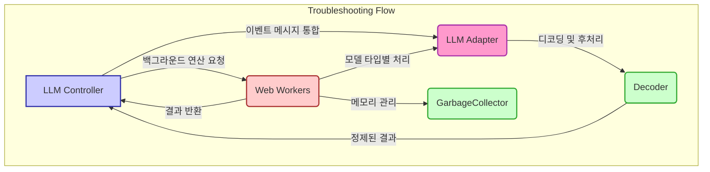

# DeepMynd: 로컬 LLM 챗봇 서비스

## 프로젝트 개요

### 목적

클라우드 기반 LLM 서비스는 편리하지만 개인 정보 유출의 위험성을 내포하고 있습니다. DeepMynd는 이러한 우려를 해소하기 위해 LLM(거대 언어 모델)을 사용자의 로컬 환경에서 직접 실행하는 방식으로 설계되었습니다. 이를 통해 사용자 데이터의 보안과 프라이버시를 강화하고, 민감한 정보가 외부로 유출될 가능성을 원천적으로 차단하는 것을 목표로 합니다.

### 주요 특징

*   **Web Worker 기반 모델 격리 및 멀티 스레딩:** Web Worker를 활용하여 LLM 모델 연산을 메인 스레드와 분리합니다. 이를 통해 무거운 AI 작업을 별도의 스레드에서 처리하여 UI 반응성을 유지하고, 멀티 스레딩 환경을 구축하여 성능을 최적화합니다.
*   **다양한 모델 포맷 지원:** ONNX, GGUF, MLC 등 널리 사용되는 다양한 LLM 모델 포맷을 지원하여 사용자가 원하는 모델을 유연하게 선택하고 활용할 수 있도록 합니다.
*   **AI 페르소나(캐릭터) 공유 및 생성:** 사용자가 직접 AI의 성격, 말투, 역할을 정의하는 '페르소나'를 만들고 다른 사용자와 공유할 수 있는 기능을 제공합니다. 이를 통해 개인화된 AI 경험을 제공합니다.
*   **동적 모델 활성화 및 Worker 제어:** 사용자의 특정 행동(예: 특정 기능 사용)에 따라 필요한 AI 모델을 자동으로 활성화하고 관련 Web Worker를 효율적으로 관리하여 시스템 자원을 최적화합니다.
*   **웹 GPU 가속 활용:** WebGPU 기술을 이용하여 그래픽 카드의 병렬 처리 능력을 AI 연산에 활용함으로써, 모델 추론 속도를 개선하고 전반적인 연산 성능을 향상시킵니다.

### 주요 기능

*   **로컬 기반 데이터베이스 관리:** 사용자 채팅 기록, 페르소나 설정 등 모든 데이터를 사용자의 로컬 기기에 저장하고 관리합니다. 이를 위해 IndexedDB 기반의 Dexie.js 라이브러리를 사용하여 오프라인 환경에서도 안정적인 데이터 접근 및 관리를 지원하며, 데이터 보안과 프라이버시를 극대화합니다.
*   **텍스트 및 이미지 생성 기능:** 사용자의 요청에 따라 텍스트 기반의 답변을 생성하는 것은 물론, 이미지 생성 AI 모델을 활용하여 이미지를 생성하는 기능도 제공합니다. AI 모델의 목적(텍스트 생성, 이미지 생성 등)에 따라 적절한 출력을 자동으로 관리하고 제공합니다.
*   **맞춤형 페르소나 설정:** 사용자가 다양한 대화 스타일과 역할을 가진 AI 페르소나를 선택하거나 직접 생성하여, 마치 여러 명의 개별적인 AI와 대화하는 듯한 다채로운 경험을 할 수 있도록 지원합니다.

## Architecture

DeepMynd는 모듈화되고 확장 가능한 아키텍처를 기반으로 설계되었습니다. 주요 컴포넌트는 다음과 같습니다.

```mermaid
graph TD
    UI[UI (사용자 인터페이스)] -->|사용자 입력/출력| ChatController
    UI -->|AI 모델 상호작용| LLMController
    UI -->|페르소나 선택/관리| PersonaController

    ChatController -->|채팅 데이터 관리| DBController
    ChatController -->|AI 응답 요청| LLMController
    ChatController -->|페르소나 정보 조회| PersonaController
    ChatController -->|상태 업데이트| UI

    PersonaController -->|페르소나 데이터 관리| DBController
    PersonaController -->|페르소나 정보 제공| ChatController
    PersonaController -->|페르소나 정보 제공| LLMController

    LLMController -->|모델 로딩/관리| WebWorker
    LLMController -->|AI 모델 추론 요청| WebWorker
    LLMController -->|페르소나 프롬프트 적용| PersonaController
    LLMController -->|결과 반환| ChatController

    WebWorker -->|모델 추론 수행| LLMController
    WebWorker -->|이벤트 기반 통신| LLMController

    DBController -->|데이터 저장/조회| IndexedDB[(Dexie.js)]
    DBController -->|데이터 동기화| ChatController
    DBController -->|데이터 동기화| PersonaController

    subgraph "Controllers"
        ChatController(ChatController)
        PersonaController(PersonaController)
        LLMController(LLMController)
        DBController(DBController)
    end

    subgraph "Workers"
        WebWorker(WebWorker)
    end

    subgraph "Data Store"
        IndexedDB
    end

    %% Styling
    classDef default fill:#f9f9f9,stroke:#333,stroke-width:2px;
    classDef controller fill:#ccf,stroke:#33a,stroke-width:2px;
    classDef worker fill:#fcc,stroke:#a33,stroke-width:2px;
    classDef db fill:#cfc,stroke:#3a3,stroke-width:2px;
    classDef ui fill:#ffc,stroke:#aa3,stroke-width:2px;

    class UI ui;
    class ChatController,PersonaController,LLMController,DBController controller;
    class WebWorker worker;
    class IndexedDB db;
```

### 1. LLMController

*   **역할:** AI 모델의 라이프사이클(초기화, 추론, 종료)을 관리하고, Web Worker와의 통신을 담당합니다.
*   **기술 구현:**
    *   **동적 워커 로딩:** `modelType`에 따라 적합한 Web Worker(Transformers.js, WebLLM, MLC 등)를 동적으로 로딩합니다.
    *   **이벤트 기반 통신:** `EventEmitter`를 사용하여 메인 스레드와 Worker 간의 양방향 비동기 통신을 효율적으로 처리합니다.
    *   **다양한 모델 포맷 지원:** ONNX (Transformers.js), GGUF (wllama), MLC (MLC-web) 등 다양한 포맷을 지원하는 로직을 내장합니다.
    *   **멀티 스레딩:** 무거운 AI 추론 작업을 별도의 Worker 스레드에서 처리하여 메인 스레드의 부하를 줄입니다.

### 2. ChatController

*   **역할:** 채팅 상태(메시지 목록, 현재 채팅방 등)를 관리하고 UI 상태와 동기화합니다.
*   **기술 구현:**
    *   **스트리밍 구현:** AI 모델의 응답을 청크 단위로 받아 `setInterval`과 `EventEmitter.subscribe`를 활용하여 UI에 실시간으로 점진적 렌더링을 수행합니다.
    *   **채팅 데이터 관리:** 채팅 목록, 고정 채팅방, 채팅 데이터 생성/삭제 등 CRUD 작업을 수행하고 DBController와 상호작용합니다.

### 3. PersonaController

*   **역할:** AI 페르소나 관련 로직(프롬프트 템플릿 관리, 생성, 수정 등)을 전담합니다.
*   **기술 구현:** 페르소나 관련 로직을 별도의 컨트롤러로 분리하여 코드의 유지보수성과 확장성을 향상시킵니다.

### 4. DBController (Dexie.js 기반)

*   **역할:** IndexedDB를 기반으로 오프라인 데이터의 지속성(Persistence)을 관리합니다.
*   **기술 구현:**
    *   **Dexie.js 활용:** IndexedDB를 추상화하여 사용하기 쉬운 API를 제공하는 Dexie.js를 통해 로컬 데이터베이스를 관리합니다.
    *   **데이터 버전 관리 및 동기화:** `EventEmitter`를 활용하여 페르소나, 모델 목록, 채팅 데이터 등의 변경 사항을 감지하고, 관련 컴포넌트(Controller)에 업데이트를 전파하여 데이터 일관성을 유지합니다.

### 기술적 포인트

*   **Web Worker 활용:** 무거운 AI 연산을 메인 스레드에서 분리하여 UI 응답성 저하를 방지합니다.
*   **EventEmitter 기반 결합도 완화 (Loose Coupling):** 컨트롤러 간의 의존성을 낮추고, 비동기 이벤트 기반 통신을 통해 효율적인 상호작용을 구현합니다.
*   **실시간 스트리밍:** AI 응답을 실시간으로 렌더링하여 사용자 경험(UX)을 극대화합니다.
*   **상태 관리:** Zustand와 같은 상태 관리 라이브러리를 활용하여 채팅 데이터, 페르소나 설정 등 애플리케이션 전반의 상태를 효율적으로 관리합니다. (TypeScript와의 연계를 통해 타입 안정성 확보)
*   **오프라인 지원:** Dexie.js를 활용하여 네트워크 연결 없이도 데이터를 로컬에서 관리하고 접근할 수 있도록 지원합니다.
*   **이벤트 기반 데이터 동기화:** 컨트롤러와 오프라인 데이터 저장소 간의 이벤트 기반 통신을 통해 데이터 무결성을 보장합니다.

### TypeScript 활용 전략

DeepMynd는 TypeScript를 적극적으로 활용하여 코드의 안정성과 개발 생산성을 높였습니다. 주요 전략은 다음과 같습니다.

*   **정적 타입 검사:** 모든 코드베이스(`.ts`, `.tsx`)에 TypeScript를 적용하여 컴파일 타임에 타입 오류를 검출하고, 런타임 에러 발생 가능성을 줄입니다. `tsconfig.json` 설정을 통해 엄격한 타입 검사 규칙을 적용합니다.
*   **인터페이스 및 타입 정의:** `types.ts`와 같은 파일을 통해 컴포넌트, 컨트롤러, API 응답 등에서 사용되는 데이터 구조에 대한 명확한 인터페이스와 타입을 정의합니다. 이는 코드의 가독성을 높이고, 모듈 간의 계약을 명확히 합니다.
*   **모듈화 및 명확한 계약:** 컨트롤러, 컴포넌트, 스토어 등 기능을 기준으로 코드를 모듈화하고, TypeScript의 인터페이스를 통해 모듈 간의 상호작용 방식을 명확하게 정의합니다. 이는 코드의 유지보수성과 확장성을 향상시킵니다.
*   **향상된 개발 경험:** 정적 타이핑은 IDE(통합 개발 환경)에서 자동 완성, 리팩토링, 코드 네비게이션 기능을 강화하여 개발 생산성을 높입니다.
*   **Worker 통신 타입 안정성:** 메인 스레드와 Web Worker 간에 주고받는 메시지에 대한 타입을 정의하여, 비동기 통신 과정에서의 데이터 구조 불일치로 인한 오류를 방지합니다.
*   **상태 관리 타입 안정성:** Zustand와 같은 상태 관리 라이브러리와 함께 TypeScript를 사용하여, 스토어의 상태 구조와 액션 페이로드에 대한 타입을 명확히 정의하고 관리합니다.

## 트러블슈팅 및 최적화

개발 과정에서 발생했던 주요 문제점과 해결 과정은 다음과 같습니다.



### 1. 채팅방별 텍스트 스트리밍 동기화 문제

*   **증상:** 다른 채팅방으로 이동했을 때, 이전 채팅방의 텍스트 스트리밍이 계속 이어지는 오류 발생.
*   **원인:** 채팅방 이동 시 `LLMController`가 참조하는 `focusing room id`가 변경되면서, Worker로부터 오는 스트리밍 데이터가 잘못된 채팅방으로 전송됨.
*   **해결 전략:** Worker에게 작업을 요청할 때 `roomId`를 함께 전달하고, Worker로부터 응답을 받을 때도 `roomId`를 포함하여 받습니다. UI에서는 수신된 데이터의 `roomId`와 현재 활성화된 채팅방의 `roomId`를 비교하여 일치하는 경우에만 데이터를 업데이트하도록 로직을 수정했습니다.

### 2. 교차 라이브러리 모델 로딩 시 메모리 충돌

*   **증상:** WebLLM(GGUF)과 MLC 모델을 동시에 로드할 경우 WASM 메모리 충돌 발생.
*   **해결 전략:** Worker 내부에서 사용하는 메모리 사용량을 추적하고, 메모리 점유율이 높을 것으로 예상되는 경우 Worker의 개수를 동적으로 조절합니다. 또한, 특정 모델의 사용이 완료되거나 장시간 메모리 점유가 예상될 경우 해당 Worker를 명시적으로 제거하여 메모리를 확보합니다.

### 3. Worker 메모리 누수

*   **증상:** 장시간 사용 시 Worker 프로세스가 정상적으로 종료되지 않아 메모리 사용량이 2GB 이상으로 증가하는 현상 발생 (특히 Transformers.js 사용 시).
*   **해결 전략:** Transformers.js 라이브러리 자체의 메모리 누수 가능성을 인지하고, 모델 작업 완료 시점에 Worker를 명시적으로 `terminate()` 메서드를 호출하여 종료시키는 로직을 추가했습니다.

## 핵심 기술 결정 배경

### 1. Worker 기반 모델 격리

*   **문제점:** 초기 개발 단계에서 ONNX 모델을 메인 스레드에서 직접 실행했을 때, 무거운 연산으로 인해 UI 렌더링이 차단되어 사용자 경험이 저하되는 문제 발생 (FPS 10 이하로 저하).
*   **해결 전략:** Web Worker를 도입하여 모델 연산을 백그라운드 스레드로 완전히 분리했습니다. 또한, 각 모델 타입(ONNX, GGUF, MLC)별로 별도의 Worker 채널을 생성하여 관리함으로써, 라이브러리 간의 잠재적인 충돌을 방지하고 메모리 누수 가능성을 최소화하는 아키텍처를 채택했습니다.

### 2. 멀티 라이브러리 통합 아키텍처

*   **문제점:** ONNX(Transformers.js), GGUF(wllama), MLC(MLC-web) 등 각기 다른 라이브러리는 초기화 방식, 이벤트 메시지 구조, 메모리 관리 정책 등에서 차이가 있어 통합 관리가 어려웠습니다.
*   **해결 전략:** 각 라이브러리의 Worker 외부에서 입력(input)/출력(output) 데이터 형식을 통일하는 어댑터(Adapter) 패턴을 적용했습니다. 또한, `EventEmitter`를 중심으로 이벤트 메시지 핸들러 구조를 표준화하여, 다양한 라이브러리를 일관된 방식으로 제어하고 통합할 수 있는 아키텍처를 구축했습니다.
